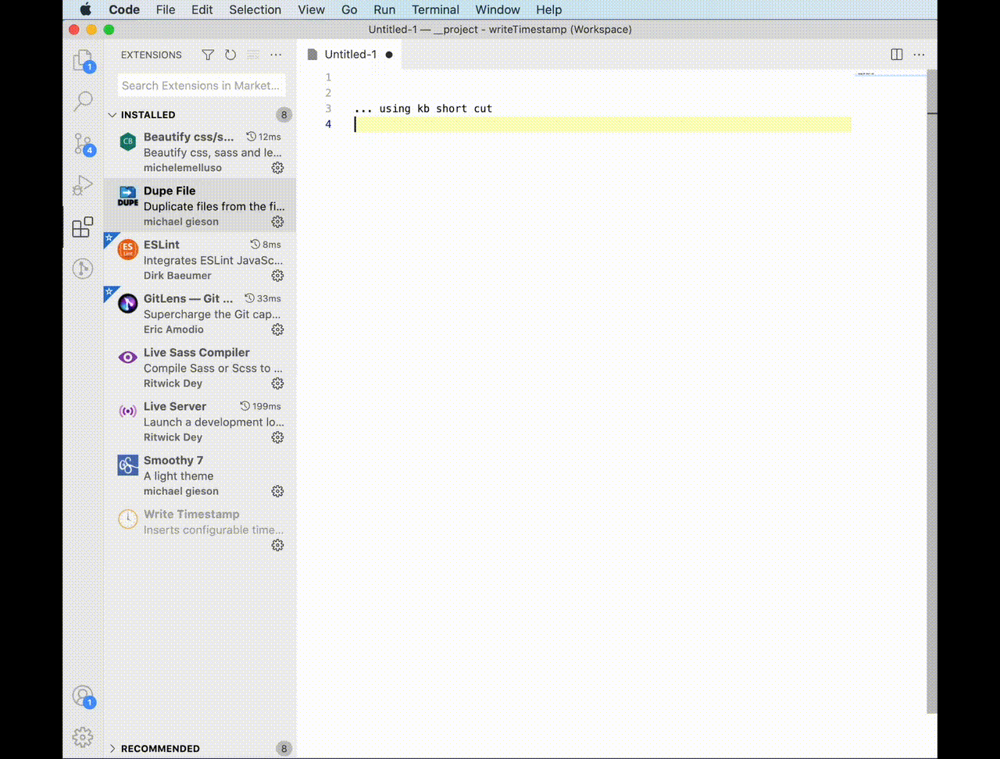

## Features

- Customizable Keyboard shortcut
- Customizable time format
- Include non-time strings in format e.g. "hello" y-m-d
- Pre-defined "common" formats available in settings.

## Defaults

Keyboard shortcut (search `writeTimestamp` in CODE > Preferences > Keyboard Shortcuts):
- PC: `ctrl-shift-t`
- MAC: `cmd-shift-t`

Settings (search `Write Timestamp` in CODE > Preferences > Settings):
- Format : type your custom format
- GMT : `false`
- List : [some pre-defined formats you can choose]

## Common Formats:

NOTE: These are availble from VSCODE's settings. Search "writeTimestamp" in CODE > Preferneces > Settings.

	y-mm-dd @ HH:MM:SS      //  2021-08-07 @ 06:01:19
	y-mm-dd                 //  2021-08-07
	y-m-d                   //  2021-8-7
	m/d/y @ HH:MM:SS        //  8/7/2021 @ 06:01:19
	m/d/y                   //  8/7/2021
	h:MM:SS AA              //  6:01:19 AM
	HH:MM:SS                //  06:01:19
	H:MM:SS                 //  6:01:19
	W, J d, y @ h:MM:SS AA  //  Saturday, August 7, 2021 @ 6:01:19 AM
	w, j d, y @ h:MM:SS AA  //  Sat, Aug 7, 2021 @ 6:01:19 AM
	w, j. d, y @ h:MM:SS AA //  Sat, Aug. 7, 2021 @ 6:01:19 AM
	J ddd, y @ h:MM:SS AA   //  August 7th, 2021 @ 6:01:19 AM
	J d, y @ h:MM:SS AA     //  August 7, 2021 @ 6:01:19 AM
	J d, y                  //  August 7, 2021
	y-mm-ddTHH:MM:SSZZ      //  2021-08-07T06:01:19-0400
	ymmddHHMMSSL            //  20210807060119538
	ymmddHHMMSS.L           //  20210807060119.538
	'hello' y-m-d           //  hello 2021-8-7

## Format options:

    d       Day of the month
    dd      Day of the month - padded
    ddd     Day of the month - with ordinal suffix (1st, 2nd, 3rd, 4th ...)
    w       Week day - short name (Sun, Mon, Tues...)
    W       Week day - full name (Sunday, Monday, Tuesday...)
    m       Month (1-12)
    mm      Month - padded (01-12)
    j       Month - short name (Jan, Feb, Mar...)
    J       Month - full name (January, Feburary, March...)
    y       Year - full (2021) 
    yy      Year - short (21)
    yyyy    Year - full  (2021) (same as y)
    H       Hours (24-hour clock)
    HH      Hours (24-hour clock) - padded
    h       Hours (12-hour clock) 
    hh      Hours (12-hour clock) - padded
    M       Minutes (0-59)
    MM      Minutes (01-59) - padded
    S       Seconds (0-59)
    SS      Seconds (01-59) - padded
    L       Milliseconds - 3 digits prefixed with a dot (.XXX)
    a       AM / PM - lowercase - single-character (a or p)
    aa      AM / PM - lowercase - two-character (am or pm)
    aaa     AM / PM - lowercase - two-character with dots (a.m. or p.m.)
    A       AM / PM - uppercase, single-character (A or P)
    AA      AM / PM - uppercase - two-character (AM or PM)
    AAA     AM / PM - uppercase - two-character with dots (A.M. or P.M.)
    z       US timezone abbreviation, e.g. EST or MDT. For non-US timezones GMT/UTC returned,  e.g. GMT-0500
    Z       GMT/UTC timezone offset, e.g. -5 or +2.5
    ZZ      GMT/UTC timezone offset, e.g. -0500 or +0230
    'foo' or "foo"     Literal character sequence.
            Examples: 
                ' "bob did this on" y-m-d '
                " 'bob did this on' y-m-d "
            Quotes are not printed. If you need to print quotes, escape with a \backslash
                Examples:
                        "bob\'s" y-m-d
                        bob said \"this\" on y-m-d 

> Tip: __Include characters not listed__ above in your format. Example: `// y-m-d` prefixes with comment "//" and adds "-" between flags

> Tip: __Include any additional words__ in your format, just surround with quotes (use single or double qutes). Example: `"shmoo" y-m-d` prefix the word "shmoo", which prevents the flags "s", "m" "h" and "o" from being evaluated, because "shmoo" was wrapped with quotes.

## Extension Settings

This extension contributes the following settings:

* `writeTimestamp.aGMT`: Use GMT (UTC) universal time. Will apply time-zone-offset to your local time to display all timestamps as GTM (UTC)
* `writeTimestamp.bCustomFormat`: Enter your own format here. Refer to the main __Write Timestamp__ extension description for flag definitions. NOTE: Clear this field to use one of the pre-defined options below.
* `writeTimestamp.cList`: Pre-defined formats. IMPORTANT NOTE: __B Custom Format__ overrides this selection. To use one of these pre-defined formats, remove anything manually entered into __B Custom Format__.

## Known Issues

none yet

## Release Notes

### 1.0.0 - 2021-08-07 @ 06:51:40 AM

Initial release 

